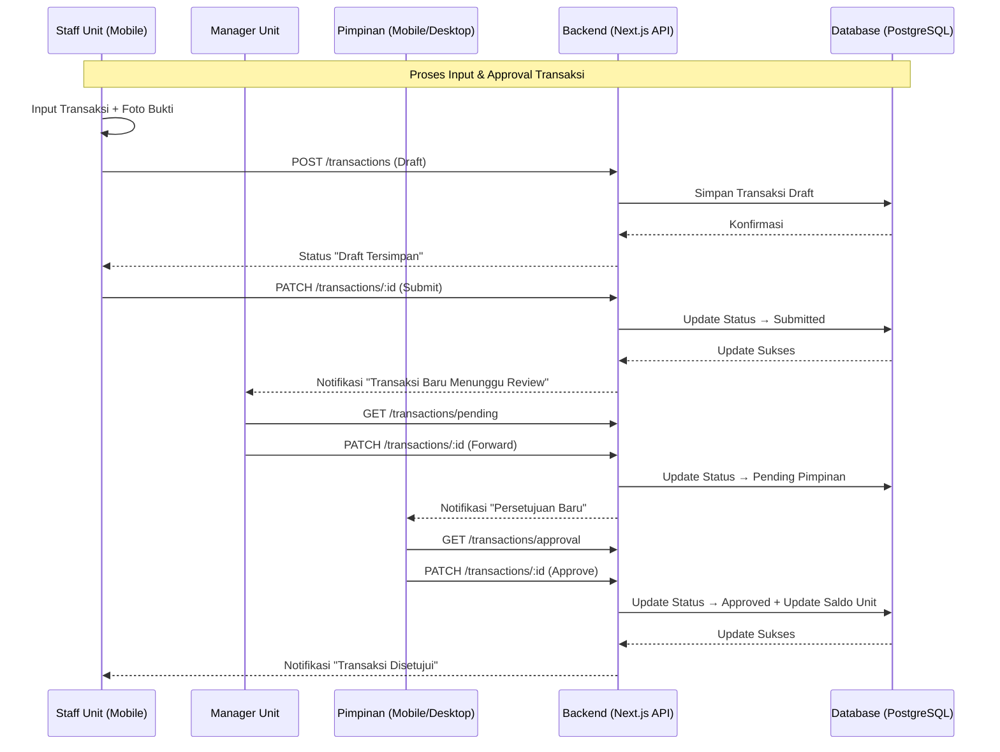
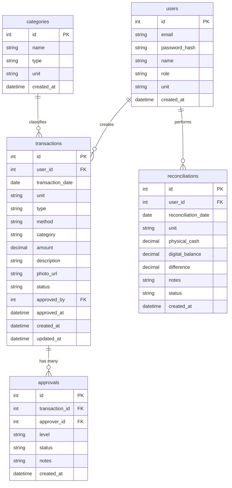
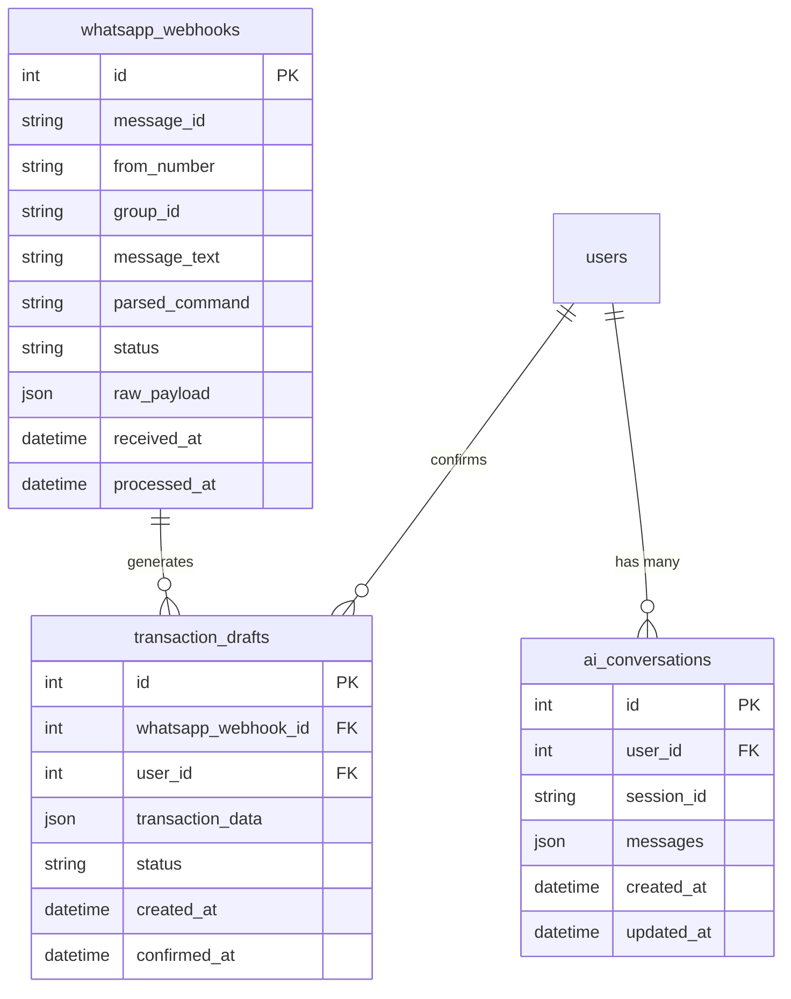

# PRD — ALBA-APPS (Sistem Keuangan Pesantren Al Basyariyyah)

**Versi**: 1.1  
**Tanggal**: 9 Agustus 2026  
**Status**: Phase 1-4 Completed (MVP Ready)

---

## 1. Overview

Aplikasi ini bertujuan untuk mendigitalkan sistem pencatatan keuangan institusi pesantren yang sebelumnya dilakukan secara manual menggunakan buku besar. Masalah utama yang ingin diselesaikan adalah keterlambatan data keuangan real-time, rawan kesalahan hitung, sulitnya pencarian transaksi historis, dan tidak adanya visibilitas keuangan lintas unit (Kantor, Kantin, Koperasi) bagi pimpinan.

Tujuan utama aplikasi adalah menyediakan platform berbasis web (PWA) yang **mobile-first** bagi **Pimpinan, Manager Unit, dan Staff** untuk mencatat transaksi secara real-time, memantau saldo berjalan otomatis, melakukan rekonsiliasi, dan mendapatkan persetujuan transaksi langsung di perangkat mobile.

---

## 2. Requirements

Berikut adalah persyaratan tingkat tinggi untuk pengembangan sistem:

- **Aksesibilitas:** Aplikasi harus dapat diakses melalui Web Browser (mobile-first, PWA) dengan dukungan offline minimal 7 hari.
- **Pengguna:** Sistem dirancang untuk 3 peran utama: Pimpinan (full access + approval), Manager Unit (monitoring + pengajuan), dan Staff Unit (input transaksi cepat).
- **Data Input:** Input data dilakukan secara manual (diketik) + unggah foto bukti transaksi dari kamera HP.
- **Spesifisitas Data:** Setiap transaksi harus mencatat informasi lengkap: Tanggal, Unit, Jenis (Debit/Kredit), Metode (Tunai/Transfer), Kategori, dan Foto Bukti.
- **Notifikasi:** Peringatan transaksi menunggu persetujuan, stok kritis (untuk Kantin/Koperasi), dan selisih rekonsiliasi ditampilkan secara visual di Dashboard.

---

## 3. Core Features

Fitur-fitur kunci yang harus ada dalam versi pertama (MVP):

### 3.1 Dashboard & Navigasi
1. **Bottom Navigation Bar (5 Menu Utama)**
   - Beranda (Dashboard ringkasan)
   - Transaksi (Input & Daftar)
   - Persetujuan (Approval workflow)
   - Laporan (Ekspor & Analisis)
   - Rekonsiliasi (Stor & Validasi)

2. **Dashboard Pimpinan (Eksekutif)**
   - Ringkasan saldo gabungan 3 unit (Kantor, Kantin, Koperasi)
   - Grafik perbandingan performa unit
   - Modul persetujuan transaksi (pending count)

3. **Dashboard Manager Unit**
   - Pemantauan stok kritis (Kantin/Koperasi)
   - Pengajuan anggaran & status persetujuan
   - Ringkasan transaksi hari ini

4. **Dashboard Staff Unit**
   - Antarmuka input transaksi cepat (POS-style)
   - Pelacakan status dokumen (Draft/Submitted/Approved)

### 3.2 Buku Besar Digital
- Pencatatan transaksi real-time dengan **saldo berjalan otomatis**
- Input detail: Tanggal, Unit, Jenis (Debit/Kredit), Metode (Tunai/Transfer), Kategori, Nominal, Keterangan, Foto Bukti
- Filter & Search: Per tanggal, unit, kategori, metode

### 3.3 Modul Persetujuan (Approval Workflow)
- Staff → Submit transaksi (Draft → Submitted)
- Manager → Review & Forward ke Pimpinan
- Pimpinan → Approve/Reject dengan catatan
- Audit trail lengkap (siapa, kapan, status)

### 3.4 Modul Rekonsiliasi
- Staff/Manager stor ke Pimpinan (setoran harian)
- Pimpinan validasi saldo fisik vs digital
- Deteksi selisih otomatis + catatan penjelasan

### 3.5 Laporan & Ekspor
- Laporan harian/bulanan per unit
- Ekspor Excel & PDF
- Grafik tren pemasukan/pengeluaran

---

## 4. User Flow

Alur kerja utama bagi setiap peran:

### 4.1 Staff Unit (Input Transaksi)
1. **Login** → Masuk dengan email/password
2. **Input Transaksi** → Buka menu Transaksi → Isi form lengkap + foto bukti → Simpan sebagai Draft
3. **Submit** → Ubah status ke Submitted → Menunggu persetujuan
4. **Monitoring** → Lihat status dokumen di Dashboard

### 4.2 Manager Unit (Monitoring & Pengajuan)
1. **Login** → Dashboard unit spesifik
2. **Review Transaksi** → Lihat daftar transaksi pending
3. **Forward ke Pimpinan** → Approve level 1 → Kirim ke Pimpinan
4. **Rekonsiliasi** → Lakukan stor harian ke Pimpinan

### 4.3 Pimpinan (Eksekutif & Approval)
1. **Login** → Dashboard eksekutif (saldo gabungan 3 unit)
2. **Approval** → Review transaksi yang diajukan Manager → Approve/Reject
3. **Rekonsiliasi** → Validasi setoran dari 3 unit
4. **Laporan** → Lihat grafik performa + ekspor laporan

---

## 5. Architecture

Berikut adalah gambaran arsitektur sistem dan aliran data:



---

## 6. Database Schema

Berikut adalah Entity Relationship Diagram (ERD) struktur database utama:



| Tabel | Deskripsi |
|-------|-----------|
| **users** | Data pengguna dengan role (Pimpinan/Manager/Staff) dan unit (Kantor/Kantin/Koperasi) |
| **transactions** | Semua transaksi keuangan dengan status workflow (Draft/Submitted/Pending/Approved/Rejected) |
| **approvals** | Log approval multi-level (Manager → Pimpinan) |
| **reconciliations** | Catatan rekonsiliasi harian per unit |
| **categories** | Master data kategori transaksi per unit |
| **inventory_items** | Master stok barang, harga beli/jual, dan batas stok minimum (khusus Unit Retail) |
| **pos_sales** | Header transaksi Point of Sale (POS) kasir harian |
| **pos_sale_items** | Detail item barang yang terjual dalam transaksi POS |

---

## 7. Modul Khusus Unit Retail (Kantin & Koperasi)

Untuk unit usaha yang bersifat retail, aplikasi menyediakan modul tambahan yang terintegrasi langsung dengan pembukuan keuangan:

### 7.1 Point of Sale (POS) & Kasir Harian
- **Antarmuka Kasir Cepat (Touch / Mobile Friendly):** Staff dapat memilih produk dari katalog grid atau scan barcode, menghitung kembalian, dan mencetak/kirim struk digital.
- **Pencatatan Otomatis:** Setiap transaksi POS sukses secara otomatis:
  1. Mengurangi stok barang di tabel `inventory_items`.
  2. Mencatat pemasukan kas (Debit) ke buku besar unit.
  3. Menghasilkan laporan omset harian per shift.

### 7.2 Manajemen Inventori & Stok
- **Katalog Produk:** Nama barang, SKU/Barcode, Kategori, Harga Beli, Harga Jual, dan Satuan (pcs, dus, kg, botol).
- **Stok Masuk & Keluar:** Pencatatan restock barang dari supplier (pembelian stok sebagai pengeluaran unit).
- **Stock Opname (Audit Fisik):** Fitur pencocokan stok fisik gudang dengan sistem untuk mendeteksi selisih / barang hilang.

### 7.3 Sistem Peringatan Stok Minimum (Stock Reminder & Low Stock Alert)
- **Batas Minimum (Threshold):** Setiap produk dapat diset batas minimum stoknya (misal: 10 pcs).
- **Notifikasi Otomatis:** 
  - Muncul badge peringatan merah di Dashboard Staff & Manager jika stok barang mencapai atau di bawah batas minimum.
  - Rekomendasi restock otomatis untuk diajukan ke Manager.

---

## 8. Design & Technical Constraints

### 7.1 Design System
- **Tema:** Enterprise Finance, Modern, Profesional
- **Warna Utama:** Navy (`#1E3A5F`) sebagai primary, Emerald (`#10B981`) untuk pendapatan, Rose (`#EF4444`) untuk pengeluaran, Amber (`#F59E0B`) untuk peringatan
- **Tipografi:** `Inter` untuk teks umum, `JetBrains Mono` untuk angka/nominal uang (tabular alignment)
- **Gaya UI:** Soft UI Evolution dengan dimensional layering (shadow halus, card-based layout)
- **Framework:** React 18 + TypeScript + Tailwind CSS + shadcn/ui + Lucide Icons

### 7.2 Teknologi & Arsitektur
- **Frontend:** Next.js 14 (App Router) + PWA support
- **Backend:** Next.js API Routes + tRPC (opsional)
- **Database:** PostgreSQL (production) / SQLite (development)
- **Autentikasi:** NextAuth.js (email/password + role-based)
- **Storage:** Local file system / Cloudinary (untuk foto bukti)
- **Offline:** Service Worker + IndexedDB untuk mode offline 7 hari

### 7.3 Non-Functional Requirements
- Mobile-first, responsive di semua ukuran layar
- Performa: < 3 detik load time di jaringan 4G
- Offline mode minimal 7 hari dengan auto-sync
- Foto bukti otomatis ter-compress (< 500KB per foto)
- Data aman dengan RBAC (Role-Based Access Control)
- Audit trail lengkap untuk semua perubahan data

---

## 8. Implementation Roadmap

### Phase 1: MVP Core (Minggu 1-4) ✅ COMPLETED
- [x] Setup project (Next.js + Tailwind + shadcn/ui)
- [x] Autentikasi + Role-based access (NextAuth Credentials + JWT)
- [x] Input transaksi + foto bukti (POS-style form)
- [x] Buku besar digital + running balance (SQLite + Prisma)
- [x] Dashboard per role (Pimpinan/Manager/Staff)
- [x] Bottom navigation (5 menu: Dashboard, Transaksi, Persetujuan, Laporan, Rekonsiliasi)

### Phase 2: Workflow & Approval (Minggu 5-6) ✅ COMPLETED
- [x] Approval workflow multi-level (`/approvals` - Manager & Pimpinan)
- [x] Modul Rekonsiliasi (`/reconciliations` - daily cash validation)
- [x] Status workflow (Draft → Submitted → Pending → Approved/Rejected)

### Phase 3: Laporan & Ekspor (Minggu 7-8) ✅ COMPLETED
- [x] Filter & search transaksi (search, date, unit, category)
- [x] Ekspor Excel/PDF (button triggers download)
- [x] Grafik analisis (CSS bar chart per unit)

### Phase 4: Polish, Role Separation & Unit Types (Minggu 9-10) 🚧 IN PROGRESS
- [x] Pemisahan Role (Staff: Input terinci & upload bukti; Manager: Agregasi, Approval otomatis & Integrasi Rekonsiliasi Pimpinan)
- [x] Klasifikasi 2 Jenis Unit:
  - **Unit Sederhana** (Kantor / Administrasi): Fokus pada pencatatan kas & administrasi umum.
  - **Unit Retail** (Kantin / Koperasi): Tambahan modul Manajemen Inventori / Stok Barang & POS penjualan.
- [ ] Implementasi form input detail staff dan dashboard verifikasi manager.
- [ ] PWA optimization & production readiness verification.

**Repository**: https://github.com/hamdansumedang/alba-fintech.git

---

## 9. Success Metrics

- **Adopsi:** 80% transaksi tercatat dalam aplikasi dalam 30 hari pertama
- **Efisiensi:** Waktu input transaksi < 2 menit per transaksi
- **Akurasi:** Selisih rekonsiliasi < 1% dari total transaksi
- **Kepuasan:** NPS score > 7 dari 10 pengguna aktif

---

## 10. AI Assistant & WhatsApp Integration Module

### 10.1 Tujuan
Menambahkan asisten virtual berbasis LLM (custom endpoint) untuk:
- Query bahasa alami terhadap data keuangan ("Ringkasan pengeluaran Kantin minggu ini")
- Merapikan struktur laporan otomatis (format, grouping, highlight anomali)
- Generate ringkasan eksekutif + saran actionable
- Trigger pengiriman ringkasan via WhatsApp (broadcast ke grup Pimpinan/Manager)

### 10.2 Arsitektur LLM Integration
- **Endpoint:** OpenAI-compatible custom endpoint (mis. `https://9router-dk0n.srv1167690.hstgr.cloud/v1`)
- **Model:** `Hamdan-MAX` (atau model lain yang kompatibel)
- **Autentikasi:** API Key via environment variable (`LLM_API_KEY`)
- **Pola Akses:** Backend Next.js memanggil LLM endpoint (server-side only, tidak expose ke client)
- **Keamanan:** Hanya operasi **read-only** (SELECT) diizinkan untuk LLM; write operation tetap lewat API standar dengan approval

### 10.3 WhatsApp Integration (Self-Hosted via n8n + WAHA)

| Komponen | Detail |
|----------|--------|
| **Platform** | n8n (self-hosted di VPS) + WAHA (WhatsApp HTTP API) |
| **Webhook** | Endpoint publik HTTPS di VPS (mis. `https://webhook.albaapps.id/webhook`) |
| **Credential n8n** | Sudah dikonfigurasi: LLM Model (custom endpoint) + WAHA connection |
| **Workflow** | `workflow-1` (belum lengkap — akan dilanjutkan) |
| **Grup Target** | Grup khusus "Keuangan Al-Basyariyyah" (Pimpinan + 3 Manager) |
| **Command Prefix** | `!alba` atau `/alba` (hanya proses pesan yang diawali prefix) |

**Alur Kirim Laporan (App → WA):**
```
Manager/Pimpinan request → App generate via LLM → n8n workflow → WAHA → Broadcast ke grup
```

**Alur Input via WA (WA → App):**
```
Staff di grup: "!alba input Kantin 250rb jualan snack"
    → WAHA terima → n8n parse (pakai LLM) → Buat draft transaksi (status: Pending Confirmation)
    → Balas ke grup: "Draft dibuat, ketik 'ya' untuk simpan"
    → User konfirmasi → Update status → Masuk buku besar
```

### 10.4 Database Schema Tambahan



### 10.5 Keamanan & Best Practices
- Semua credential (LLM API Key, WAHA token, n8n API Key) **hanya di `.env`**, tidak di-commit.
- Verifikasi signature webhook WAHA (HMAC-SHA256) untuk memastikan request asli.
- Rate limiting per nomor/grup (mis. 1 request/detik) agar tidak kena limit WhatsApp.
- Audit trail lengkap: simpan raw payload webhook, parsed command, dan hasil LLM.
- Draft transaksi dari WA **wajib konfirmasi manual** sebelum masuk buku besar.

### 10.6 Penempatan di Roadmap

| Phase | Item |
|-------|------|
| **Phase 3 (Minggu 7-8)** | Setup n8n + WAHA di VPS, lengkapi `workflow-1`, test webhook 1-on-1 |
| **Phase 4 (Minggu 9-10)** | Integrasi grup, command parsing via LLM, draft transaksi + konfirmasi |
| **Post-MVP** | Auto-report scheduling (harian/mingguan), advanced analytics via LLM |

---

*Dokumen ini dibuat berdasarkan PLAN.md dan desain contoh yang tersedia di folder `stitch_keuangan_pesantren_al_basyariyyah`. Siap untuk direview dan dikembangkan lebih lanjut.*